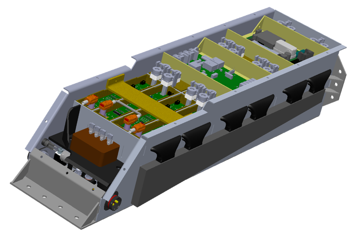
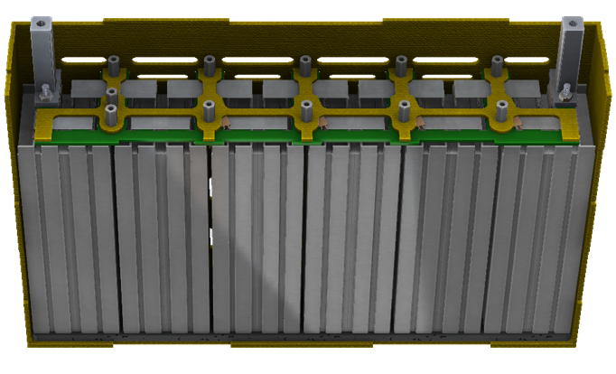
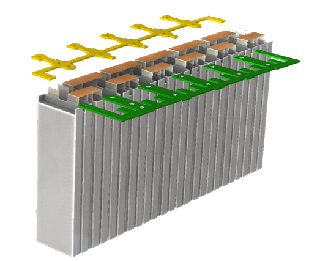
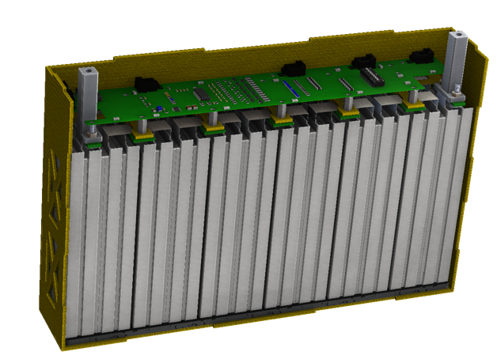
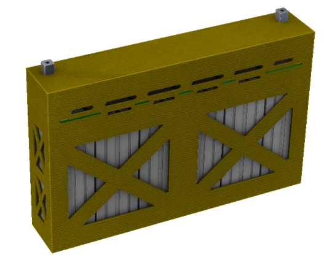
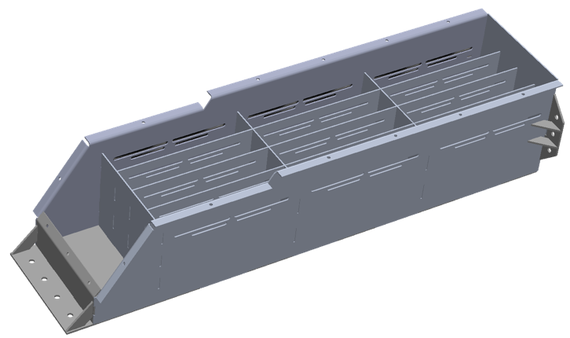
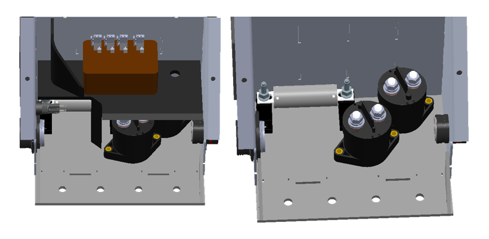

# Battery-Pack-Design

The Accumulator Container/Battery Pack has 288 batteries and a maximum voltage of 600V with 7.45kWh and consists of 12 segments of batteries (12s2p), 2 high-voltage relay contacts and a high current fast-blow fuse.

Here, it is shown the full assembly of the container. Let's see more carefully each individual part.

Bellow, it is shown the design of one segment.

Let's look at it more thoroughly.

We placed a small PCB and a kevlar piece in order to take the voltage measurements and give them to the BMS PCB.

Bellow, you can see the BMS PCB.

Here, all segments are connected together.

Here is the aluminum container of the battery pack.

The two relay contactors and the fuse are placed in the front part of the container.

